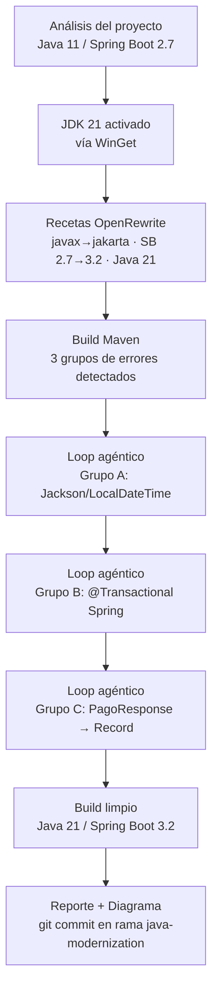

<div class="breadcrumb">📍 <a href="/guia-bob-banco-mercantil/">Inicio</a> › Guía Consolidada (versión PDF)</div>

# Guía Práctica de IBM Bob — Banco Mercantil
## Documento Consolidado · Versión para PDF

> **Audiencia:** Desarrolladores Java del Core Bancario  
> **Prerequisito:** Acceso a IBM Bob  
> **Tiempo total estimado:** ~90 min · con caso extra: ~115 min

---

# Obtén el Código Antes de Empezar

Todos los casos de uso tienen archivos Java listos para abrir en IBM Bob.

### Opción A — Díselo a Bob (la más fácil, sin saber de Git)

Cambia a **🔴 Agent Mode**, copia el siguiente prompt y envíalo:

```
Actúa como ingeniero DevOps. Clona el repositorio:
https://github.com/BestebanTc-IBM/guia-bob-banco-mercantil.git

- Windows: usa C:\Users\<usuario_actual>\Documents\proyectos-bob\
- macOS/Linux: usa ~/Documents/proyectos-bob/
Crea la carpeta si no existe. Verifica que Git esté instalado.
No clones si la carpeta ya existe. Reporta la ruta final.
```

### Opción B — Con Git manualmente

```bash
git clone https://github.com/BestebanTc-IBM/guia-bob-banco-mercantil.git
```

Abre IBM Bob → **Archivo → Abrir carpeta** → selecciona `guia-bob-banco-mercantil/`

### Opción C — Sin Git: descarga el ZIP

Ve a [github.com/BestebanTc-IBM/guia-bob-banco-mercantil](https://github.com/BestebanTc-IBM/guia-bob-banco-mercantil) → botón verde **`< > Code`** → **`Download ZIP`** → extrae y abre la carpeta en IBM Bob.

---

# Parte 1 — Fundamentos de IBM Bob

## ¿Qué es IBM Bob?

IBM Bob es un **agente de IA para desarrolladores** integrado directamente en el entorno de trabajo:

- **Razona sobre el proyecto completo**: todas las clases, dependencias e historial de la sesión.
- **Conversa en lenguaje natural**: describe el problema y Bob responde con análisis, propuestas o cambios.
- **Actúa de forma autónoma**: lee, crea, edita y navega múltiples archivos en un solo flujo.
- **Mantiene memoria de sesión**: recuerda el contexto de lo discutido durante la misma sesión.
- **Tres modos distintos**: Ask (análisis sin cambios), Plan (diseño previo), Agent (ejecución directa).

---

## Los Tres Modos de Bob

### 🔵 Modo Ask — *"Explícame sin tocar nada"*

Úsalo cuando quieres **entender** algo: una clase heredada, un algoritmo de cálculo de comisiones, un proceso batch sin documentar.

Bob lee los archivos y responde en lenguaje natural. **No modifica ningún archivo.**

**Cuándo usarlo en el banco:**
- Entender lógica de cálculo de intereses o comisiones heredada
- Auditar un flujo de validación de cuentas
- Preguntar por qué un proceso falla sin saber dónde empezar

---

### 🟡 Modo Plan — *"Diseñemos antes de escribir"*

Úsalo cuando tienes un requerimiento nuevo y quieres una **propuesta de arquitectura o plan de implementación** antes de generar código.

**Cuándo usarlo en el banco:**
- Diseñar un nuevo microservicio de consulta de movimientos
- Planificar la migración de un servicio SOAP a REST
- Proponer la estructura de un módulo para revisión del equipo

---

### 🔴 Modo Agent — *"Hazlo tú, yo reviso"*

El modo más poderoso. Bob puede **leer, crear, editar y eliminar archivos** del proyecto de forma autónoma.

> ⚠️ **Consejo Senior:** Empieza en Ask o Plan para entender el contexto. Cambia a Agent solo cuando sabes exactamente qué quieres. Siempre revisa el diff antes de aceptar cambios en archivos críticos.

---

## La Interfaz en 60 Segundos

```
┌──────────────────────────────────────────────────────────────────┐
│  IBM BOB          ⚙️  ≡  +  ...  ⬜  ✕               61k/270k  │
│                   │   │  │                                  ↑    │
│                   │   │  └─ Nuevo chat          Contador tokens  │
│                   │   └─── Historial de chats anteriores         │
│                   └─────── Configuración del agente              │
├──────────────────────────────────────────────────────────────────┤
│  [ área de conversación / respuestas de Bob ]                    │
├──────────────────────────────────────────────────────────────────┤
│  📋 N archivos modificados    [Deshacer todos]  [Mostrar todos]  │
├──────────────────────────────────────────────────────────────────┤
│  ┌────────────────────────────────────────────────────────────┐  │
│  │  Escribe tu mensaje...                                     │  │
│  └────────────────────────────────────────────────────────────┘  │
│   +   Agent ▾   🔒 Permisos ▾                        ✨   ▶     │
└──────────────────────────────────────────────────────────────────┘
```

| Control | Para qué sirve |
|---|---|
| **`+`** (Adjuntar) | Agregar archivos Java, logs, configs al contexto |
| **`Agent ▾`** | Cambiar entre Ask, Plan y Agent |
| **`🔒 Permisos ▾`** | Controlar qué archivos puede tocar Bob |
| **`✨`** (Mejorar prompt) | Bob reformula tu prompt con más contexto y precisión |
| **`≡`** (Historial) | Ver y retomar conversaciones anteriores |

> 💡 **El contador de tokens** (`61k/270k`): por encima del 80% considera iniciar un nuevo chat para evitar que Bob pierda el hilo.

---

## Buenas Prácticas de Prompts

### Anatomía de un prompt bancario de calidad

```
[ROL]         Actúa como desarrollador Java senior especializado en core bancario
[CONTEXTO]    Tengo adjunto TransferenciaService.java. Este servicio procesa
              transferencias interbancarias en tiempo real usando la API de SWIFT.
[TAREA]       Necesito que detectes todos los puntos donde se usan tipos primitivos
              (double, float) para representar montos monetarios y los refactorices
              a BigDecimal con escala 2 y RoundingMode.HALF_UP.
[RESTRICCIÓN] No cambies las firmas públicas de los métodos.
[FORMATO]     Muéstrame primero la lista de cambios, luego el código corregido,
              y al final un resumen de riesgo de cada cambio.
```

### Niveles de prompt

| Nivel | Cuándo usarlo | Ejemplo |
|---|---|---|
| **Básico** | Exploración inicial, código desconocido | `"Explícame qué hace calcularComision() en el archivo adjunto."` |
| **Intermedio** | Tarea concreta con área ya identificada | `"El método calcularComisionInterbancaria() no aplica la exención para cuentas PREMIUM. Analiza la lógica."` |
| **Experto** | Cambios en código crítico de producción | Prompt con ROL + CONTEXTO + TAREA + RESTRICCIONES + FORMATO |

### Tabla de decisión de modo

| Quiero... | Modo |
|---|---|
| Entender código que no escribí | Ask |
| Revisar si una lógica financiera es correcta | Ask |
| Planificar un nuevo servicio antes de codificar | Plan |
| Proponer arquitectura para revisión del equipo | Plan |
| Corregir un bug específico | Agent |
| Generar pruebas para una clase existente | Agent |
| Implementar lo que planeé | Plan → Agent |

### Errores frecuentes al usar Bob con código bancario

**1. Adjuntar demasiados archivos sin orientar a Bob**
```
❌ [Adjunta 15 archivos] "¿Qué está mal aquí?"
✅ [Adjunta 2 archivos relevantes] "El error ocurre en PagoService.java línea 47.
   Adjunto también CuentaDTO.java porque es el objeto que se pasa al método."
```

**2. Pedir cambios globales sin restricciones**
```
❌ "Refactoriza todo el servicio para usar patrones modernos."
✅ "Refactoriza únicamente el método validarCuenta() para reducir su complejidad
   ciclomática. No toques los demás métodos del servicio."
```

**3. Pedir a Bob que adivine el contexto de negocio**
```
❌ "¿Es correcto este cálculo?"
✅ "Según la regulación SUDEBAN vigente, las transferencias entre bancos distintos
   deben aplicar una comisión del 0.5% con tope de 50 BsD.
   ¿El método calcularComision() implementa esta regla correctamente?"
```

### El ciclo de trabajo recomendado para código crítico

```
1. Ask Mode   → "Explícame cómo funciona X antes de que toque algo"
2. Ask Mode   → "¿Qué riesgos hay si cambio Y?"
3. Plan Mode  → "Proponme los pasos para implementar Z"
4. (Revisar y ajustar el plan con tu equipo)
5. Agent Mode → "Ejecuta el paso 1 del plan que acordamos"
6. Ask Mode   → "Revisa el cambio. ¿Hay algo que hayas pasado por alto?"
```

---

# Parte 2 — Casos de Uso Básicos

---

## Caso 1 · Ask Mode: Comprensión de Lógica Financiera

**Modo:** 🔵 Ask &nbsp;|&nbsp; **Tiempo:** 10 min &nbsp;|&nbsp; **Nivel:** Básico

### Contexto

Eres nuevo en el equipo de Core Bancario. Te asignan revisar el módulo de cálculo de comisiones interbancarias, que nadie en el equipo ha tocado en 3 años. El archivo tiene 200 líneas, sin comentarios, con varios métodos encadenados.

**Objetivo:** Usar Bob en modo Ask para entender completamente la lógica antes de cualquier cambio.

### Código de Partida

Archivo: `codigo/caso-01/ComisionService.java`

```java
package com.bancomercantil.core.comisiones;

import java.math.BigDecimal;
import java.math.RoundingMode;

public class ComisionService {

    private static final BigDecimal TASA_INTERBANCARIA_BASE = new BigDecimal("0.0035");
    private static final BigDecimal TASA_PREMIUM            = new BigDecimal("0.0020");
    private static final BigDecimal UMBRAL_MONTO_ALTO       = new BigDecimal("50000.00");
    private static final BigDecimal COMISION_MINIMA         = new BigDecimal("2.50");
    private static final BigDecimal COMISION_MAXIMA         = new BigDecimal("500.00");

    public BigDecimal calcularComision(BigDecimal monto, String tipoCuenta, boolean esClientePremium) {
        if (monto == null || monto.compareTo(BigDecimal.ZERO) <= 0) {
            throw new IllegalArgumentException("El monto debe ser mayor que cero");
        }
        BigDecimal tasa = resolverTasa(monto, tipoCuenta, esClientePremium);
        BigDecimal comision = monto.multiply(tasa).setScale(2, RoundingMode.HALF_UP);
        return aplicarLimites(comision);
    }

    private BigDecimal resolverTasa(BigDecimal monto, String tipoCuenta, boolean esClientePremium) {
        if (esClientePremium) return TASA_PREMIUM;
        if ("CORRIENTE".equals(tipoCuenta) && monto.compareTo(UMBRAL_MONTO_ALTO) > 0) {
            return TASA_INTERBANCARIA_BASE.multiply(new BigDecimal("0.80"))
                                         .setScale(4, RoundingMode.HALF_UP);
        }
        return TASA_INTERBANCARIA_BASE;
    }

    private BigDecimal aplicarLimites(BigDecimal comision) {
        if (comision.compareTo(COMISION_MINIMA) < 0) return COMISION_MINIMA;
        if (comision.compareTo(COMISION_MAXIMA) > 0) return COMISION_MAXIMA;
        return comision;
    }

    public boolean validarCuenta(String numeroCuenta, String tipoCuenta) {
        if (numeroCuenta == null || numeroCuenta.isBlank()) return false;
        if (!numeroCuenta.matches("\\d{10,20}")) return false;
        return switch (tipoCuenta) {
            case "CORRIENTE", "AHORRO", "PLAZO_FIJO" -> true;
            default -> false;
        };
    }
}
```

### Paso a Paso con Bob

**Paso 1 — Selecciona el modo 🔵 Ask**

> Por qué Ask y no Agent: solo queremos entender, no modificar. Ask es completamente seguro para exploración.

**Paso 2 — Adjunta el archivo**

Arrastra `ComisionService.java` al chat de Bob, o escribe `@ComisionService.java` en el prompt.

**Paso 3 — Primer prompt: Visión general**

```
Tengo adjunto el archivo ComisionService.java.
Explícame de forma clara y estructurada:
1. Qué hace este servicio en términos de negocio bancario.
2. Cuáles son los flujos principales del método calcularComision().
3. Qué reglas de negocio están implementadas (tarifas, límites, condiciones).
4. Qué casos borde podrían no estar cubiertos.
No modifiques ningún archivo.
```

**Paso 4 — Segundo prompt: Diagrama de flujo**

```
Genera un diagrama de flujo del método calcularComision() usando un bloque
mermaid con sintaxis flowchart TD.

Reglas para que el diagrama no falle en el parser de Mermaid:
- No uses || ni && dentro de los nodos; escríbelos como texto: "es null o menor que cero".
- No uses < > = en etiquetas de nodos; escríbelos como palabras: "mayor que", "menor que".
- No uses comas en números (50000 no 50,000).
- Nodos rectangulares entre [ ], decisiones entre { }.
- Etiquetas de aristas solo con Sí / No o texto simple.
```

> ⚠️ **Nota:** No le pidas a Bob que calcule comisiones numéricas paso a paso. Los LLMs pueden dar resultados incorrectos con total confianza en aritmética decimal. Para verificar valores concretos, ejecuta el código directamente en Java.

**Paso 5 — Tercer prompt: Auditoría de casos borde**

```
Actúa como auditor de software bancario.

Analiza solo el flujo lógico del código — sin hacer cálculos numéricos.

Para cada escenario indica qué rama se ejecuta y si hay riesgo:
  1. monto = null
  2. monto = 0.00 o negativo
  3. tipoCuenta = null o "EMPRESARIAL" o "corriente" (minúsculas)
  4. monto = 50000.00 exactamente vs 50000.01 en cuenta CORRIENTE
  5. esClientePremium = true con tipoCuenta = null

Devuelve una tabla: Escenario | Rama ejecutada | Riesgo (Alto/Medio/Bajo)
```

### Resultado Esperado

Al terminar los tres prompts deberás poder responder sin mirar el código:

- [ ] ¿Cuál es la tasa para un cliente premium?
- [ ] ¿Qué pasa con una cuenta de tipo "EMPRESARIAL"?
- [ ] ¿Qué comisión paga alguien que transfiere exactamente $50,000?
- [ ] ¿Qué pasa si el monto calculado es $1.00?

### Lo Que Aprendiste

1. **Ask Mode no modifica archivos**: es completamente seguro para exploración.
2. **Bob entiende dominio bancario**: no necesitas explicarle qué es una tasa interbancaria.
3. **Los prompts en cadena son más poderosos**: cada respuesta enriquece el contexto del siguiente.
4. **Bob como colega de revisión**: úsalo para auditar código antes de tocarlo.

---

## Caso 2 · Agent Mode: Corrección de Bug de Precisión Monetaria

**Modo:** 🔴 Agent &nbsp;|&nbsp; **Tiempo:** 10 min &nbsp;|&nbsp; **Nivel:** Básico

### Contexto

El equipo recibió un reporte: **algunas transferencias muestran diferencias de centavos en el balance del cliente**. El servicio `TransferenciaService.java` usa `double` para los cálculos monetarios — un bug clásico con impacto real en el core bancario.

### El Problema: ¿Por qué `double` es un Bug en Bancos?

```java
// Esto parece correcto pero NO lo es:
double saldo = 100.10;
double debito = 0.20;
System.out.println(saldo - debito);
// Resultado: 99.89999999999999  ← ¡Error de centavos!

// Correcto con BigDecimal:
BigDecimal saldo = new BigDecimal("100.10");
BigDecimal debito = new BigDecimal("0.20");
System.out.println(saldo.subtract(debito));
// Resultado: 99.90  ✓
```

### Código de Partida

Archivo: `codigo/caso-02/TransferenciaService.java`

```java
package com.bancomercantil.core.transferencias;

public class TransferenciaService {

    public double calcularMontoFinal(double monto, double comision) {
        return monto + comision;
    }

    public double aplicarImpuesto(double monto, double tasaImpuesto) {
        return monto * (1 + tasaImpuesto);
    }

    public double calcularSaldoResultante(double saldoActual, double montoDebito, double montoCredito) {
        double resultado = saldoActual - montoDebito + montoCredito;
        return Math.round(resultado * 100.0) / 100.0;  // Redondeo manual que NO garantiza exactitud
    }

    public boolean tieneFondosSuficientes(double saldo, double montoSolicitado) {
        return saldo >= montoSolicitado;
    }

    public double calcularComisionConDescuento(double monto, double comisionBase, double descuento) {
        double comisionFinal = comisionBase - (comisionBase * descuento);
        return monto + comisionFinal;
    }
}
```

### Paso a Paso con Bob

**Paso 1 — Cambia al modo 🔴 Agent**

> ⚠️ En este modo Bob SÍ puede editar archivos. Revisa siempre el diff antes de aceptar.

**Paso 2 — Adjunta el archivo** y arrastra `TransferenciaService.java` al chat.

**Paso 3 — Prompt de diagnóstico primero (buena práctica)**

```
Tengo adjunto TransferenciaService.java.
Identifica todos los lugares donde se usa el tipo primitivo double
para cálculos monetarios. Explica brevemente por qué cada uno
representa un riesgo en un sistema bancario.
No modifiques ningún archivo todavía.
```

Espera la respuesta. Bob debería identificar los 5 métodos con `double`.

**Paso 4 — Prompt de corrección y verificación**

```
Realiza la refactorización y validación de TransferenciaService.java:

1. Migración a BigDecimal:
   - Reemplaza todos los tipos 'double' por 'BigDecimal'.
   - Usa siempre constructores de String (ej. new BigDecimal("100.10")), nunca literales double.
   - Aplica .setScale(2, RoundingMode.HALF_UP) a los cálculos monetarios.
   - En tieneFondosSuficientes(), usa compareTo() en lugar de >=.
   - Conserva los nombres de métodos, firmas lógicas y reglas de negocio intactas.
   - Agrega los imports necesarios de java.math.BigDecimal y java.math.RoundingMode.

2. Pruebas y Verificación:
   - Crea un archivo TransferenciaServiceTest.java con un método main() autónomo
     (sin dependencias externas de JUnit) que valide todos los métodos y casos borde
     (como el desfase de centavos en 100.10 - 0.20).
   - Compila y ejecuta las pruebas mostrando el reporte en consola.
```

> 🛡️ **Seguridad y Control — "Human in the Loop":**
>
> En este paso, Bob te solicitará autorización para **ejecutar comandos de terminal** (compilación con `javac` y ejecución con `java`).
>
> - **Revisión obligatoria:** Antes de presionar *Aceptar*, inspecciona el comando sugerido en pantalla.
> - **Criterio técnico:** Si el comando es seguro y coherente con la tarea, apruébalo; de lo contrario, recházalo o pide un ajuste. **La IA propone, pero tú como desarrollador mantienes el control total de la ejecución.**

**Paso 5 — Revisa el diff antes de aceptar**

- [ ] ¿Todos los `double` fueron reemplazados?
- [ ] ¿Los constructores usan String, no literales?
- [ ] ¿El método `tieneFondosSuficientes` usa `compareTo()`?
- [ ] ¿Los imports están agregados?

**Paso 6 — Verifica el resultado**

```java
// Así debería quedar tieneFondosSuficientes:
public boolean tieneFondosSuficientes(BigDecimal saldo, BigDecimal montoSolicitado) {
    return saldo.compareTo(montoSolicitado) >= 0;
}
```

### Resultado Esperado

- [ ] No contiene ninguna ocurrencia de `double` en parámetros o variables de negocio
- [ ] Usa `BigDecimal` con escala explícita en todos los cálculos
- [ ] Compila sin errores
- [ ] Mantiene la misma firma lógica de cada método
- [ ] Pasa el 100% de las pruebas generadas en `TransferenciaServiceTest.java`

### Lo Que Aprendiste

1. **Agent Mode edita y ejecuta**: a diferencia de Ask, aquí Bob puede modificar código y ejecutar verificaciones.
2. **El patrón diagnóstico → corrección**: primero confirmar, luego actuar. Aplica a cualquier cambio crítico.
3. **El diff es tu red de seguridad**: revisa siempre los cambios propuestos antes de aceptarlos.
4. **Verificación autónoma en el prompt**: solicitar tests con `main()` permite validar los cambios inmediatamente sin fricción de dependencias.

---

## Caso 3 · Agent Mode: Pruebas JUnit y Documentación de Negocio

**Modo:** 🔴 Agent &nbsp;|&nbsp; **Tiempo:** 10 min &nbsp;|&nbsp; **Nivel:** Básico

### Contexto

El módulo de validación de cuentas tiene **0% de cobertura de pruebas** y la próxima semana hay una auditoría interna. Pero hay un segundo problema: el coordinador de QA necesita evidencia de los criterios de aceptación en un formato que pueda leer y adjuntar en el ticket de Jira — **sin acceso al código fuente**.

**Objetivo:** Con un solo flujo en Bob generar dos salidas:
1. `CuentaValidatorServiceTest.java` — pruebas JUnit 5 con `@DisplayName` descriptivos
2. `CRITERIOS-VALIDACION-CUENTAS.md` — documentación de criterios de aceptación para QA

### Código de Partida

Archivo: `codigo/caso-03/CuentaValidatorService.java`

```java
package com.bancomercantil.core.cuentas;

import java.math.BigDecimal;

public class CuentaValidatorService {

    private static final BigDecimal LIMITE_SOBREGIRO = new BigDecimal("-5000.00");
    private static final BigDecimal LIMITE_DIARIO    = new BigDecimal("100000.00");

    public enum EstadoCuenta { ACTIVA, BLOQUEADA, INACTIVA, PENDIENTE }

    public boolean puedeDebitar(BigDecimal saldoActual, BigDecimal montoDebito,
                                EstadoCuenta estado, BigDecimal montoAcumuladoHoy) {
        if (estado != EstadoCuenta.ACTIVA) return false;
        if (montoDebito == null || montoDebito.compareTo(BigDecimal.ZERO) <= 0) return false;
        BigDecimal saldoResultante = saldoActual.subtract(montoDebito);
        if (saldoResultante.compareTo(LIMITE_SOBREGIRO) < 0) return false;
        BigDecimal nuevoAcumulado = montoAcumuladoHoy.add(montoDebito);
        return nuevoAcumulado.compareTo(LIMITE_DIARIO) <= 0;
    }

    public boolean esNumeroCuentaValido(String numeroCuenta) {
        if (numeroCuenta == null || numeroCuenta.isBlank()) return false;
        if (!numeroCuenta.matches("\\d{10,20}")) return false;
        int suma = 0;
        for (int i = 0; i < numeroCuenta.length(); i++) {
            int digito = Character.getNumericValue(numeroCuenta.charAt(i));
            suma += (i % 2 == 0) ? digito * 2 : digito;
        }
        return suma % 10 == 0;
    }

    public String determinarTipoOperacion(BigDecimal saldoActual, BigDecimal monto,
                                          boolean esTransferenciaInternacional) {
        if (esTransferenciaInternacional) {
            return monto.compareTo(new BigDecimal("10000.00")) > 0 ? "SWIFT_ALTO_VALOR" : "SWIFT_NORMAL";
        }
        if (saldoActual.compareTo(BigDecimal.ZERO) < 0) return "DEBITO_SOBREGIRO";
        return "DEBITO_NORMAL";
    }
}
```

### Paso a Paso con Bob

**Paso 1 — Selecciona 🔴 Agent y adjunta el archivo**

> ⚠️ En Agent Mode Bob puede crear y editar archivos. Revisa siempre el diff antes de aceptar.

**Paso 2 — Elige tu estilo de prompt**

| | Prompt corto | Prompt detallado |
|---|---|---|
| **Cuándo usarlo** | Exploración rápida o primera iteración | Código crítico, auditorías, entrega a QA |
| **Cobertura** | Bob infiere los casos — puede haber omisiones | Tú defines los casos — cobertura garantizada |
| **Calidad del output** | Variable según el contexto inferido | Consistente y predecible |

**Opción 1 — Prompt corto:**

```
Tengo adjunto CuentaValidatorService.java. Es un servicio de validación bancaria.

Genera dos archivos y guárdalos en codigo/caso-03/:

1. CuentaValidatorServiceTest.java — pruebas JUnit 5 completas, @DisplayName en español
   legible para QA, @ParameterizedTest para validaciones de número de cuenta,
   comentarios "// CRITERIO DE NEGOCIO:" en los casos críticos.

2. CRITERIOS-VALIDACION-CUENTAS.md — documento para el coordinador de QA con tabla
   de criterios, casos borde en lenguaje de negocio (sin código) y reglas implícitas.
```

**Opción 2 — Prompt detallado (recomendado para auditorías):**

```
Actúa como desarrollador Java senior y analista de calidad bancario.
Tengo adjunto CuentaValidatorService.java.

Genera DOS archivos en paralelo y guárdalos en codigo/caso-03/:

--- ARCHIVO 1: CuentaValidatorServiceTest.java ---
Pruebas JUnit 5 para los tres métodos del servicio.
- Paquete: com.bancomercantil.core.cuentas
- @DisplayName en español, formato: "Debe [resultado] cuando [condición]"
- @ParameterizedTest + @ValueSource para esNumeroCuentaValido()
- Casos obligatorios para puedeDebitar():
    • Cuenta BLOQUEADA → false
    • Cuenta INACTIVA → false
    • Saldo suficiente, cuenta ACTIVA → true
    • Monto que deja saldo exactamente en -5000.00 → true
    • Monto que deja saldo en -5000.01 → false
    • Acumulado diario que supera 100000.00 → false
    • montoDebito nulo → false
    • montoDebito en cero → false
- Comentario inline // CRITERIO DE NEGOCIO: en cada test que lo amerite

--- ARCHIVO 2: CRITERIOS-VALIDACION-CUENTAS.md ---
Documento de criterios de aceptación para el coordinador de QA.
Secciones:
- Resumen ejecutivo
- Tabla: ID | Método | Condición | Resultado Esperado | Estado
- Casos Borde Críticos en lenguaje de negocio (sin código Java)
- Reglas de Negocio Implícitas (límites, umbrales, estados válidos)
- Versión y Cobertura (fecha, N tests generados)
```

**Paso 3 — Revisa el diff de los dos archivos**

Para `CuentaValidatorServiceTest.java`:
- [ ] ¿Hay al menos 12 métodos de prueba?
- [ ] ¿Los `@DisplayName` están en español y son legibles sin ver el código?
- [ ] ¿El caso del límite exacto (-5000.00) retorna `true`?

Para `CRITERIOS-VALIDACION-CUENTAS.md`:
- [ ] ¿Tiene tabla con columnas ID / Método / Condición / Resultado / Estado?
- [ ] ¿Los casos borde están descritos sin código Java?

**Paso 4 — Abre la Vista Previa de Markdown en IBM Bob**

1. En el explorador de archivos, navega a `codigo/caso-03/`
2. Haz clic derecho sobre `CRITERIOS-VALIDACION-CUENTAS.md`
3. Selecciona **"Abrir vista previa"** (o **"Open Preview"**)

Verás el documento renderizado con tablas y encabezados — exactamente como lo recibirá el coordinador de QA al abrirlo en GitHub.

> 💡 La Vista Previa de Markdown es útil para documentación técnica, READMEs de microservicios, criterios de aceptación y runbooks. No necesitas abrir ninguna herramienta externa.

### Ejemplo de Prueba Bien Generada

```java
@Test
@DisplayName("Debe permitir débito cuando el saldo resultante iguala exactamente el límite de sobregiro")
void debePermitirDebito_cuandoSaldoResultanteEsExactamenteLimiteSobregiro() {
    // CRITERIO DE NEGOCIO: -5000.00 es el límite, no se supera, debe autorizarse
    BigDecimal saldo     = new BigDecimal("-4999.00");
    BigDecimal monto     = new BigDecimal("1.00"); // resultado: exactamente -5000.00
    BigDecimal acumulado = BigDecimal.ZERO;

    assertTrue(validator.puedeDebitar(saldo, monto, EstadoCuenta.ACTIVA, acumulado));
}
```

### Lo Que Aprendiste

1. **Un prompt puede generar múltiples archivos**: Bob no está limitado a un output por conversación.
2. **`@DisplayName` como contrato de negocio**: las pruebas bien nombradas son documentación ejecutable que QA puede leer sin conocer Java.
3. **Vista Previa de Markdown**: IBM Bob renderiza `.md` directamente — no necesitas salir del entorno.
4. **El mismo trabajo sirve a dos audiencias**: el test es para el desarrollador; el `.md` es para QA, negocio y auditoría.

---

# Parte 3 — Casos de Uso Avanzados

---

## Caso 4 · Plan → Agent: Diseño e Implementación de Microservicio REST

**Modos:** 🟡 Plan → 🔴 Agent &nbsp;|&nbsp; **Tiempo:** 15 min &nbsp;|&nbsp; **Nivel:** Avanzado

### Contexto

El área de **Canales Digitales** necesita un microservicio REST para que la app móvil consulte el historial de movimientos con filtros de fecha y tipo, e incluya un mecanismo de **bloqueo preventivo** para transacciones sospechosas.

El tech lead quiere que el equipo proponga el diseño antes de escribir una sola línea de código, para validarlo en el comité de arquitectura.

### Parte 1 — Modo Plan: Diseñar Antes de Codificar

**Paso 1 — Selecciona modo 🟡 Plan**

**Paso 2 — Prompt de diseño arquitectónico**

```
Actúa como arquitecto de software Java senior especializado en banca.
Necesito diseñar un microservicio REST con las siguientes características:

DOMINIO: Consulta de movimientos de cuentas bancarias con bloqueo preventivo.

REQUERIMIENTOS FUNCIONALES:
- GET /api/v1/cuentas/{numeroCuenta}/movimientos
  → Filtros opcionales: fechaDesde, fechaHasta, tipoMovimiento (DEBITO/CREDITO)
  → Paginación: page, size (máximo 50 por página)
  → Retorna: id, fecha, monto, tipo, descripcion, saldoResultante
- POST /api/v1/cuentas/{numeroCuenta}/bloqueo-preventivo
  → Body: { "motivo": string, "duracionMinutos": int }
  → Solo roles AUDITOR y SUPERVISOR pueden ejecutarla

REQUERIMIENTOS TÉCNICOS:
- Java 11, Spring Boot 2.7
- Sin base de datos real (datos en memoria para el ejercicio)
- Manejo estándar de errores HTTP (400, 404, 403, 500)
- Validación de entrada con Bean Validation

Produce:
1. Lista de clases a crear con su responsabilidad.
2. Estructura de paquetes recomendada.
3. Esquema de los DTOs de request/response.
4. Posibles riesgos técnicos y decisiones de diseño importantes.
No escribas código todavía.
```

**Paso 3 — Valida el plan con el equipo**

Preguntas clave para el comité de arquitectura:
- ¿La paginación con máximo 50 registros es suficiente para los patrones de uso?
- ¿El bloqueo preventivo debe persistir entre reinicios del servicio?
- ¿Qué mecanismo de roles usará el banco (JWT, LDAP, API Connect)?

**Paso 4 — Refina el plan con correcciones**

```
Modifica el plan considerando:
- El bloqueo preventivo debe ser en memoria (sin persistencia), adecuado para un piloto.
- La autenticación de roles se simula con un header X-User-Role en lugar de JWT
  (simplificación para el ejercicio, en producción se usaría el token de API Connect).
- Agrega un endpoint adicional: DELETE /api/v1/cuentas/{numeroCuenta}/bloqueo-preventivo
  para desbloquear manualmente.
```

### Parte 2 — Modo Agent: Implementar el Plan

**Paso 5 — Cambia a modo 🔴 Agent**

**Paso 6 — Prompt de generación de estructura**

```
Basándote en el plan que acabamos de diseñar, genera la estructura completa
del microservicio. Crea los siguientes archivos:

1. MovimientoDTO.java — DTO de respuesta con los campos: id (Long), fecha (LocalDate),
   monto (BigDecimal), tipo (String), descripcion (String), saldoResultante (BigDecimal).

2. BloqueoRequest.java — DTO de request con motivo (String, obligatorio, max 200 chars)
   y duracionMinutos (int, entre 1 y 1440).

3. MovimientoService.java — Interfaz con los métodos:
   - List<MovimientoDTO> obtenerMovimientos(...)
   - void aplicarBloqueo(String numeroCuenta, String motivo, int duracionMinutos)
   - void removerBloqueo(String numeroCuenta)
   - boolean estaBloqueada(String numeroCuenta)

4. MovimientoServiceImpl.java — Implementación en memoria con 5 movimientos
   hardcodeados para la cuenta "0123456789".

5. MovimientoController.java — Controlador REST con los 3 endpoints.
   Valida el header X-User-Role para los endpoints de bloqueo.

Usa el paquete base: com.bancomercantil.movimientos
```

**Paso 7 — Verifica la implementación**

```
Revisa el controlador generado y confirma:
1. ¿El endpoint DELETE de desbloqueo también valida el header X-User-Role?
2. ¿El método obtenerMovimientos aplica correctamente los filtros de fecha y tipo
   cuando son null (es decir, cuando no se envían en la request)?
3. ¿Las respuestas de error (403, 404) son consistentes con el estándar REST?
Si hay algo incorrecto, corrígelo.
```

### Resultado Esperado

- [ ] 5 archivos Java creados y compilables
- [ ] El controlador maneja correctamente los 3 endpoints
- [ ] El servicio en memoria filtra por fecha y tipo
- [ ] Los roles son validados en los endpoints de bloqueo
- [ ] Los errores retornan HTTP correcto (403 para rol incorrecto, 404 para cuenta no encontrada)

### Lo Que Aprendiste

1. **Plan Mode produce arquitectura documentada**: ideal para presentar al comité técnico antes de codificar.
2. **El flujo Plan → Agent es el más poderoso**: Plan define el "qué y cómo", Agent lo ejecuta.
3. **La refinación del plan es parte del proceso**: no es un error cambiar el plan, es la naturaleza del diseño colaborativo.
4. **Bob mantiene el contexto entre Plan y Agent**: no necesitas repetir los requerimientos al cambiar de modo.

---

## Caso 5 · Ask → Agent: Reporte de Auditoría Incompleto en el Proceso de Conciliación

**Modos:** 🔵 Ask → 🔴 Agent &nbsp;|&nbsp; **Tiempo:** 15 min &nbsp;|&nbsp; **Nivel:** Avanzado

### Contexto

El equipo de **Auditoría Interna** observó que los reportes nocturnos de conciliación **no cumplen con los requisitos mínimos del regulador (SUDEBAN)**. El informe solo muestra referencia, estado y monto, pero la norma exige: fecha de procesamiento, origen de la discrepancia y marca explícita de si el registro requiere revisión humana.

El desarrollador senior te dice: *"el problema está en `generarReporteTexto`, arréglalo"*.

**Lo que no sabe el desarrollador**: el problema no está solo en ese método.

### Archivos de Partida

Carpeta: `codigo/caso-05/` — contiene 4 archivos:

| Archivo | Rol |
|---|---|
| `ConciliacionBatchService.java` | Orquesta el proceso y genera el reporte |
| `TransaccionCore.java` | Modelo de transacción del sistema Core bancario |
| `TransaccionExterno.java` | Modelo de transacción del corresponsal / red interbancaria |
| `ResultadoConciliacion.java` | Encapsula el resultado de conciliar una referencia |

> 💡 **Antes de continuar:** Asegúrate de que Bob tiene la carpeta `caso-05/` abierta como contexto de trabajo, no solo el archivo del servicio.

### Parte 1 — Ask Mode: Diagnóstico Real del Problema

**Paso 1 — Selecciona 🔵 Ask Mode**

**Paso 2 — Prompt de diagnóstico**

```
Tengo abiertos los archivos de la carpeta caso-05.
El equipo de auditoría dice que generarReporteTexto() en ConciliacionBatchService
no produce información suficiente para cumplir con la norma regulatoria del banco.
La norma exige que cada línea del reporte incluya:
  - La fecha en que se procesó la conciliación
  - Si el registro requiere revisión humana (sí/no)
  - El estado reportado por el sistema externo cuando hay discrepancia

Sin modificar nada todavía, analiza si generarReporteTexto() puede producir
esa información con los datos que recibe, y si no puede, explica exactamente
por qué no puede hacerlo.
```

**Respuesta esperada de Bob:** el problema no es solo `generarReporteTexto()`, sino una cadena de 3 omisiones:
1. `conciliarTransacciones()` nunca asigna `fechaProcesamiento` ni `observaciones`.
2. El `estadoExterno` de `TransaccionExterno` nunca se transfiere al `ResultadoConciliacion`.
3. `generarReporteTexto()` nunca llama a `requiereRevision()` aunque el método ya existe.

**Paso 3 — Prompt de alcance del cambio**

```
Entonces para que el reporte cumpla la norma, ¿cuántos archivos hay que modificar?
Lista cada archivo, qué cambio específico necesita, y en qué orden deberían hacerse
los cambios para no romper la compilación entre pasos.
```

> 🔍 **Observa:** Bob acaba de identificar que hay que tocar 2 archivos distintos. Eso es análisis de dependencias cruzadas.

### Parte 2 — Agent Mode: Corrección en Cadena

**Paso 4 — Cambia a 🔴 Agent Mode**

> ⚠️ Bob va a proponer cambios en **múltiples archivos**. Revisa cada archivo antes de aceptar.

**Paso 5 — Prompt de corrección multiarchivo**

```
Aplica los cambios necesarios en los archivos de la carpeta caso-05 para que
el reporte de conciliación cumpla la norma regulatoria. Los cambios deben:

1. En ResultadoConciliacion.java: agregar el campo estadoExterno (String) con
   su getter y setter.

2. En ConciliacionBatchService.conciliarTransacciones():
   - Asignar fechaProcesamiento = LocalDate.now() en los tres bloques.
   - Copiar te.getEstadoExterno() al ResultadoConciliacion SOLO en el bloque
     donde la referencia coincide en ambos sistemas.

3. En ConciliacionBatchService.generarReporteTexto():
   - Agregar fechaProcesamiento, requiereRevision() como REVISION:SI/NO,
     y estadoExterno (null → N/A).

No cambies TransaccionCore.java ni TransaccionExterno.java.
```

**Paso 6 — Verificación cruzada**

```
Para una transacción NO_ENCONTRADA_CORE, ¿estadoExterno queda null o tiene
algún valor asignado? ¿Es correcto ese comportamiento?
```

### Resultado Esperado

- [ ] `ResultadoConciliacion.java` tiene `estadoExterno` con getter y setter
- [ ] `conciliarTransacciones()` asigna `fechaProcesamiento` en los **3 bloques**
- [ ] `generarReporteTexto()` imprime: referencia | fecha | REVISION:SI/NO | estado | diferencia | ESTADO\_EXTERNO (o N/A)
- [ ] `TransaccionCore.java` y `TransaccionExterno.java` **no fueron modificados**
- [ ] El panel muestra exactamente **2 archivos** tocados

### Lo Que Aprendiste

1. **Un síntoma en un método puede tener la raíz en otro archivo**.
2. **Bob razona sobre dependencias entre archivos** al tener la carpeta como contexto.
3. **El panel de archivos modificados es tu red de seguridad**.
4. **Ask Mode para diagnóstico evita el error clásico** de ir directo a Agent.

---

# Parte 4 — Premium Java Package

---

## Caso 6 · Premium Java Package: Java Upgrade Workflow (Java 11 → Java 21)

**Capacidad:** IBM Bob Premium Package for Java Modernization — **Java Upgrade Workflow**  
**Tiempo:** 25–35 min &nbsp;|&nbsp; **Nivel:** Especial

### Contexto

El área de infraestructura aprobó la migración del core bancario de **Java 11 a Java 21 LTS**. El mayor bloqueador técnico es que múltiples servicios aún usan `javax.*` (EE 8), renombrado a `jakarta.*` en Jakarta EE 9+, requerido por Spring Boot 3.x.

### ¿Qué es el IBM Bob Premium Package for Java Modernization?

| Workflow | Qué hace |
|---|---|
| **Java Upgrade** | Migra de Java 8/11 a Java 17/21/25 con recetas OpenRewrite + loops agénticos |
| **Liberty Modernization** | Migra de WebSphere tradicional a Liberty, guiado por reporte AMA |
| **Unit Test Generation** | Genera pruebas JUnit con ciclos generate–run–fix |
| **UI Modernization** | Separa monolitos JSF/Struts en backend Java + frontend React |
| **Vulnerability Remediation** | Escanea dependencias contra la base de datos OSV (CVEs) |

> **Requisito:** Licencia activa del IBM Bob Premium Package for Java Modernization e IBM Bob 2.0.0+.

### Prerrequisitos

- [ ] IBM Bob 2.0.0+ instalado y autenticado
- [ ] Licencia del Premium Package for Java activa
- [ ] JDK 8 mínimo instalado (JDK 21 pre-instalado recomendado)
- [ ] `pom.xml` o `build.gradle` válido y proyecto compilando en Java 11

```bash
git checkout -b java-modernization
git add -A && git commit -m "baseline: antes de Java 11 → 21 upgrade"
```

### Código de Partida

Archivo: `codigo/caso-06/PagoService.java` — Java 11 / Spring Boot 2.7 / `javax.*`

```java
package com.bancomercantil.pagos;

import javax.validation.Valid;
import javax.validation.constraints.NotNull;
import javax.persistence.EntityNotFoundException;
import javax.transaction.Transactional;
import java.math.BigDecimal;
import java.util.Date;
import java.util.Optional;

public class PagoService {

    @Transactional
    public PagoResponse procesarPago(@Valid @NotNull PagoRequest request) {
        Date fechaProcesamiento = new Date();
        Pago pago = new Pago();
        pago.setReferencia(generarReferencia());
        pago.setMonto(request.getMonto());
        pago.setFecha(fechaProcesamiento);
        pago.setEstado("PENDIENTE");
        Optional<Pago> pagoExistente = buscarPorReferencia(pago.getReferencia());
        if (pagoExistente.isPresent()) {
            throw new EntityNotFoundException("Referencia duplicada: " + pago.getReferencia());
        }
        return new PagoResponse(pago.getReferencia(), pago.getEstado(), fechaProcesamiento);
    }

    // Candidata a Record en Java 16+
    public static class PagoResponse {
        private final String referencia;
        private final String estado;
        private final Date fecha;
        public PagoResponse(String r, String e, Date f) {
            this.referencia=r; this.estado=e; this.fecha=f;
        }
        public String getReferencia() { return referencia; }
        public String getEstado()     { return estado; }
        public Date   getFecha()      { return fecha; }
    }
}
```

### Ejecución del Java Upgrade Workflow

**Paso 1 — Inicia el workflow**

En el panel de Bob, haz clic en **Start Workflow → Java Upgrade**, o escribe:

```
Java Upgrade
```

**Paso 2 — Evaluación del proyecto**

| Ruta de upgrade | Incluye Jakarta EE | Dificultad |
|---|---|---|
| Java 11 → 17 | Opcional | Media |
| Java 11 → 21 ✅ | Recomendado | Media-Alta |
| Java 11 → 25 | Recomendado | Alta |

Selecciona **Java 21** + migración Jakarta EE simultánea.

**Paso 3 — Instalación del JDK (si aplica)**
- Windows: `winget install Microsoft.OpenJDK.21`
- Linux/macOS: `sdk install java 21-tem`

**Paso 4 — Recetas OpenRewrite (automatizadas)**

| Receta | Transformación |
|---|---|
| `JavaxMigrationToJakarta` | Migra todos los `javax.*` → `jakarta.*` |
| `UpgradeSpringBoot_3_2` | Actualiza `spring-boot-starter-parent` a 3.2.x |
| `JavaVersion21` | Actualiza `maven.compiler.source/target` a 21 |

**Paso 5 — Build + diagnóstico de errores**

Bob agrupa los errores por causa raíz:
```
GRUPO A — Incompatibilidad serialización Jackson + LocalDateTime
GRUPO B — @Transactional jakarta.transaction vs Spring
GRUPO C — PagoResponse: candidata a Java Record
```

**Paso 6 — Loop agéntico de corrección**

```java
// ANTES
import jakarta.transaction.Transactional;
public static class PagoResponse { /* 10 líneas boilerplate */ }

// DESPUÉS
import org.springframework.transaction.annotation.Transactional;
public record PagoResponse(String referencia, String estado, LocalDateTime fecha) {}
```

**Paso 7 — Reporte final**



### Comparación Final: Java 11 vs Java 21

| Aspecto | Java 11 / Spring Boot 2.7 | Java 21 / Spring Boot 3.2 |
|---|---|---|
| Namespace de validación | `javax.validation.*` | `jakarta.validation.*` |
| Namespace de persistencia | `javax.persistence.*` | `jakarta.persistence.*` |
| Gestión de transacciones | `javax.transaction.Transactional` | `org.springframework.transaction.annotation.Transactional` |
| API de fecha | `java.util.Date` | `java.time.LocalDateTime` |
| DTOs inmutables | Clases con getters boilerplate | Java Records |
| Concurrencia | Threads del sistema operativo | Virtual Threads disponibles |
| GC | G1 por defecto | ZGC listo para producción |

### Resultado Esperado

- [ ] `PagoService.java` sin ningún import `javax.*`
- [ ] `@Transactional` → `org.springframework.transaction.annotation.Transactional`
- [ ] `PagoResponse` convertido a Java Record
- [ ] `java.util.Date` → `LocalDateTime` con configuración Jackson correcta
- [ ] `pom.xml` apuntando a Spring Boot 3.2 y Java 21
- [ ] Build completamente limpio
- [ ] Commit en rama `java-modernization` listo para PR

---

# Parte 5 — Caso Extra

---

## Caso 7 · Dashboard Web Operativo Bancario 🚀

**Modos:** 🟡 Plan → 🔴 Agent &nbsp;|&nbsp; **Tiempo:** 25 min &nbsp;|&nbsp; **Nivel:** Extra

### Contexto

El área de **Operaciones Bancarias** solicita un dashboard HTML interno. Los datos ya los expone `MetricasDashboardController.java`.

**Restricciones:** HTML + CSS + JS puro, sin frameworks, sin librerías externas, funciona abriendo el `.html` directamente en el navegador.

### Paso 1 — Modo Plan: Define la estructura

```
Actúa como desarrollador frontend senior con expertise en dashboards internos bancarios.
Tengo adjunto MetricasDashboardController.java con 4 endpoints.

Diseña la estructura de un dashboard HTML:
- HTML + CSS + JavaScript puro (sin React, Vue, jQuery, Bootstrap)
- Gráficos con SVG inline o barras CSS
- Funciona abriendo el .html directamente

Produce wireframe textual, lista de componentes, paleta bancaria y plan en 3 pasos.
No escribas código todavía.
```

### Paso 2 — Checklist del plan

- [ ] Header con nombre del banco y reloj en tiempo real
- [ ] Al menos 4 KPI cards con animación de contador
- [ ] Gráfico de conciliación (donut SVG)
- [ ] Tabla de top cuentas con barras proporcionales
- [ ] Panel de alertas con colores por nivel
- [ ] Gráfico de volumen por hora

### Paso 3 — Agent Mode: Genera el dashboard

```
Basándote en el plan, genera dashboard-operativo.html (HTML self-contained).

COMPONENTES:
1. HEADER azul oscuro (#0f3460): "Banco Mercantil · Dashboard Operativo" + reloj en español
2. 5 KPI CARDS: Transacciones (12,847 verde), Monto (Bs.487.5M azul),
   Pendientes (234 amarillo), Rechazadas (17 rojo), Conciliación (98.78% azul).
   Los contadores se animan de 0 al valor final al cargar.
3. Donut SVG: Conciliadas 98.78%, Con diferencia 0.85%, No encontradas 0.37%
4. Top 5 cuentas enmascaradas con barras CSS proporcionales
5. 3 alertas con borde de color por nivel (ALTO/MEDIO/BAJO)
6. 6 barras horizontales de volumen por hora (06:00-11:00, pico en 09:00)
7. Footer: "Dashboard Operativo · Banco Mercantil · Datos actualizados cada 5 min"

ESTILO: fondo #f1f2f6, cards blancas, responsive (1 col mobile, 2 col desktop)
```

### Conectarlo a Datos Reales

```
Refactoriza el JS para hacer fetch() a:
- GET http://localhost:8080/api/v1/dashboard/resumen-dia
- GET http://localhost:8080/api/v1/dashboard/conciliacion
- GET http://localhost:8080/api/v1/dashboard/top-cuentas
- GET http://localhost:8080/api/v1/dashboard/alertas

Si el fetch falla, usa los datos hardcodeados como fallback.
Refresca cada 5 minutos automáticamente.
```

### Lo Que Demuestra

Bob no es solo un asistente Java. El mismo flujo Plan → Agent funciona para backend, frontend, scripts, configuraciones y documentación.

---

# Apéndice — Referencia Rápida

## Resumen de Todos los Casos

| Caso | Modo | Capacidad demostrada | Tiempo |
|---|---|---|---|
| 1 — Lógica Financiera | 🔵 Ask | Comprensión sin riesgo, diagramas Mermaid, auditoría de casos borde | 10 min |
| 2 — Bug BigDecimal | 🔴 Agent | Diagnóstico + corrección + verificación autónoma, Human in the Loop | 10 min |
| 3 — Pruebas JUnit | 🔴 Agent | Tests + documentación de negocio, Vista Previa de Markdown | 10 min |
| 4 — Microservicio REST | 🟡 Plan → 🔴 Agent | Arquitectura documentada + implementación completa | 15 min |
| 5 — Conciliación SUDEBAN | 🔵 Ask → 🔴 Agent | Diagnóstico multiarchivo, dependencias cruzadas, corrección en cadena | 15 min |
| 6 — Java 11 → 21 | Premium Workflow | OpenRewrite + loops agénticos + Java Records + reporte Mermaid | 25–35 min |
| 7 — Dashboard Web 🚀 | 🟡 Plan → 🔴 Agent | Frontend HTML/CSS/JS, SVG, responsive, datos mock (caso extra) | 25 min |

## Resumen de Modos y Cuándo Usarlos

| Modo | Modifica archivos | Usa cuando... |
|---|---|---|
| 🔵 Ask | No | Quieres entender sin riesgo |
| 🟡 Plan | No | Quieres diseñar antes de codificar |
| 🔴 Agent | Sí | Quieres que Bob actúe |

## Checklist del Desarrollador Bob

**Antes de enviar un prompt:**
- [ ] ¿Está el modo correcto seleccionado?
- [ ] ¿Adjunté los archivos relevantes o tengo la carpeta del proyecto abierta?
- [ ] ¿Mi prompt tiene ROL, CONTEXTO, TAREA y RESTRICCIONES?
- [ ] ¿Usé el botón ✨ para mejorar el prompt si la tarea es importante?

**Antes de aceptar cambios de Agent Mode:**
- [ ] ¿Revisé el diff completo?
- [ ] ¿Los cambios están dentro del alcance que pedí?
- [ ] ¿Para código bancario crítico, pedí un prompt de validación lógica?
- [ ] ¿Revisé el comando de terminal antes de aprobar su ejecución?

## Frases Útiles para Prompts

| Situación | Frase |
|---|---|
| Limitar el alcance | `"No modifiques ningún archivo todavía"` |
| Pedir confirmación antes de actuar | `"Primero lista los cambios que harás"` |
| Contexto bancario | `"Actúa como desarrollador Java senior del core bancario"` |
| Validación | `"Verifica que el resultado es correcto para estos casos: ..."` |
| Restricción técnica | `"Usa solo clases del JDK estándar, sin dependencias externas"` |
| Diagnóstico sin cambios | `"Analiza solo el flujo lógico — no hagas cálculos numéricos"` |
| Multiarchivo | `"Tengo abierta la carpeta completa. Analiza las dependencias entre todos los archivos."` |

## Conceptos que Confunden al Principio

**"¿Guarda mi código en la nube?"**  
El código se procesa bajo las políticas de datos de tu contrato empresarial IBM. **Nada de lo que compartes se usa para entrenar modelos de IA.** El procesamiento ocurre dentro del perímetro de seguridad de IBM.

**"Si Bob modifica un archivo, ¿puedo deshacer?"**  
Sí. Los cambios se muestran como diff antes de aplicarse. IBM Bob mantiene el historial de deshacer.

**"¿Funciona con COBOL?"**  
Sí. Bob tiene capacidades para COBOL, JCL y otros lenguajes de mainframe. Los principios de esta guía aplican igual.

---

*Guía preparada para la PoC de IBM Bob · Banco Mercantil · 2026*  
*Archivos de código fuente disponibles en la carpeta `codigo/` del repositorio*  
*Repositorio: [github.com/BestebanTc-IBM/guia-bob-banco-mercantil](https://github.com/BestebanTc-IBM/guia-bob-banco-mercantil)*
