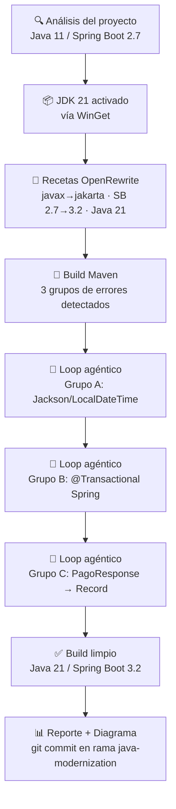

<div class="breadcrumb">📍 <a href="/guia-bob-banco-mercantil/">Inicio</a> › Caso 6 — Premium ⭐</div>

# Caso 6 — Premium Java Package: Java Upgrade Workflow (Java 11 → Java 21)

> **Capacidad:** IBM Bob Premium Package for Java Modernization — **Java Upgrade Workflow** &nbsp;|&nbsp; **Tiempo:** 25–35 min &nbsp;|&nbsp; **Nivel:** Especial

---

## Contexto del Caso

El área de infraestructura aprobó la migración del core bancario de **Java 11 a Java 21 LTS** como parte del plan trienal de modernización. El mayor bloqueador técnico es que múltiples servicios del banco aún usan `javax.*` (EE 8), que fue renombrado a `jakarta.*` en Jakarta EE 9+, requerido por Spring Boot 3.x.

El equipo tiene un servicio legado `PagoService.java` con estas dependencias y necesita migrar sin romper la funcionalidad.

**Objetivo:** Ejecutar el **Java Upgrade Workflow** del IBM Bob Premium Package for Java Modernization para guiar la migración de forma automatizada, con recetas OpenRewrite y loops de corrección agénticos.

---

## ¿Qué es el IBM Bob Premium Package for Java Modernization?

El Premium Package extiende IBM Bob con flujos de trabajo guiados y multi-paso diseñados para la modernización de Java empresarial. **No son prompts manuales** — son workflows orquestados que Bob ejecuta de forma estructurada:

| Workflow | Qué hace |
|---|---|
| **Java Upgrade** | Migra de Java 8/11 a Java 17/21/25 con recetas OpenRewrite + loops agénticos de corrección |
| **Liberty Modernization** | Migra de WebSphere tradicional a Liberty, guiado por un reporte AMA |
| **Unit Test Generation** | Genera pruebas JUnit con estrategia primero, luego ciclos generate–run–fix |
| **UI Modernization** | Separa monolitos JSF/Struts en backend Java + frontend React |
| **Vulnerability Remediation** | Escanea dependencias contra la base de datos OSV (CVEs) |

> **Requisito:** Licencia activa del IBM Bob Premium Package for Java Modernization y IBM Bob 2.0.0 o superior.

---

## Arquitectura del Java Upgrade Workflow

Cuando se ejecuta el Java Upgrade Workflow, Bob sigue esta secuencia automatizada:

```
┌─────────────────────────────────────────────────────────────────────┐
│                    JAVA UPGRADE WORKFLOW                            │
├──────────────────┬──────────────────────────────────────────────────┤
│  1. Inteligencia │ Detecta JDKs instalados, build tool (Maven/      │
│     del proyecto │ Gradle), versión Java actual, frameworks         │
│                  │ (Spring, Hibernate, EJB, JSF, Struts, GWT)       │
├──────────────────┼──────────────────────────────────────────────────┤
│  2. Instalar JDK │ Instala y activa JDK 21 vía WinGet (Windows)     │
│                  │ o SDKMan (Linux/macOS)                           │
├──────────────────┼──────────────────────────────────────────────────┤
│  3. Recetas      │ Selecciona y aplica las recetas OpenRewrite       │
│     OpenRewrite  │ correctas: javax→jakarta, APIs deprecadas,       │
│                  │ versiones de dependencias                        │
├──────────────────┼──────────────────────────────────────────────────┤
│  4. Build +      │ Compila el proyecto, extrae errores estructurados │
│     Diagnóstico  │ de los logs de Maven/Gradle, agrupa por causa    │
├──────────────────┼──────────────────────────────────────────────────┤
│  5. Loop         │ Subagente de IA corrige errores por módulo,       │
│     Agéntico     │ rebuilds hasta compilación limpia                │
├──────────────────┼──────────────────────────────────────────────────┤
│  6. Reporte      │ Genera diagrama Mermaid con todas las tareas,    │
│                  │ tiempo de ejecución y resumen de cambios          │
└──────────────────┴──────────────────────────────────────────────────┘
```

---

## Prerrequisitos

Antes de iniciar el workflow, verifica lo siguiente:

**Sistema:**
- [ ] IBM Bob 2.0.0 o superior instalado y autenticado
- [ ] Licencia del Premium Package for Java activa
- [ ] JDK 8 mínimo instalado (JDK 21 pre-instalado es recomendado)
- [ ] WinGet disponible en Windows (para instalación automática de JDK)
- [ ] Git inicializado con working directory limpio

**Proyecto:**
- [ ] `pom.xml` o `build.gradle` válido en la raíz del proyecto
- [ ] Proyecto abierto al nivel de raíz correcto en el IDE
- [ ] Estructura estándar: `src/main/java`, `src/test/java`
- [ ] Todas las dependencias resueltas y proyecto compilando en Java 11

**Preparación recomendada:**
```bash
# Crea una rama dedicada antes de iniciar
git checkout -b java-modernization
git add -A && git commit -m "baseline: antes de Java 11 → 21 upgrade"
```

---

## Código de Partida

Descarga del repositorio:
- [`PagoService.java`](https://github.com/BestebanTc-IBM/guia-bob-banco-mercantil/blob/main/codigo/caso-06/PagoService.java) — Java 11 / Spring Boot 2.7 / `javax.*`
- [`pom.xml`](https://github.com/BestebanTc-IBM/guia-bob-banco-mercantil/blob/main/codigo/caso-06/pom.xml) — Spring Boot 2.7 / Java 11

```java
package com.bancomercantil.pagos;

import javax.validation.Valid;
import javax.validation.constraints.NotNull;
import javax.persistence.EntityNotFoundException;
import javax.transaction.Transactional;
import java.math.BigDecimal;
import java.util.Date;       // API de fecha legada
import java.util.Optional;

public class PagoService {

    @Transactional
    public PagoResponse procesarPago(@Valid @NotNull PagoRequest request) {
        if (request.getMonto() == null || request.getMonto().compareTo(BigDecimal.ZERO) <= 0) {
            throw new IllegalArgumentException("Monto inválido");
        }

        Date fechaProcesamiento = new Date();

        Pago pago = new Pago();
        pago.setReferencia(generarReferencia());
        pago.setMonto(request.getMonto());
        pago.setFecha(fechaProcesamiento);
        pago.setEstado("PENDIENTE");

        Optional<Pago> pagoExistente = buscarPorReferencia(pago.getReferencia());
        if (pagoExistente.isPresent()) {
            throw new EntityNotFoundException("Referencia duplicada: " + pago.getReferencia());
        }

        return new PagoResponse(pago.getReferencia(), pago.getEstado(), fechaProcesamiento);
    }

    private String generarReferencia() {
        return "PAG-" + System.currentTimeMillis();
    }

    private Optional<Pago> buscarPorReferencia(String referencia) {
        return Optional.empty();
    }

    // Candidata a Record en Java 16+
    public static class PagoResponse {
        private final String referencia;
        private final String estado;
        private final Date fecha;

        public PagoResponse(String referencia, String estado, Date fecha) {
            this.referencia = referencia;
            this.estado = estado;
            this.fecha = fecha;
        }
        public String getReferencia() { return referencia; }
        public String getEstado()     { return estado; }
        public Date   getFecha()      { return fecha; }
    }
}
```

---

## Ejecución del Java Upgrade Workflow

### Paso 1 — Inicia el workflow desde Bob

En el panel de chat de Bob, haz clic en el botón **Start Workflow** y selecciona **Java Upgrade**, o escribe directamente en el prompt:

```
Java Upgrade
```

> Bob detectará automáticamente tu build tool, versión Java actual y frameworks presentes. No necesitas adjuntar archivos manualmente — el workflow analiza el workspace completo.

---

### Paso 2 — Evaluación del proyecto (automatizada)

Bob ejecuta la **fase de inteligencia del proyecto**. Verás en el chat cómo Bob:

1. Detecta Maven/Gradle y la versión actual del JDK
2. Escanea los frameworks: Spring Boot 2.7, Hibernate, Bean Validation
3. Detecta la presencia de `javax.*` en toda la base de código
4. Propone las rutas de actualización disponibles con nivel de dificultad

**Salida esperada de Bob:**

| Ruta de upgrade | Incluye Jakarta EE | Dificultad | Desafíos principales |
|---|---|---|---|
| Java 11 → 17 | Opcional (EE 8→10) | Media | APIs deprecadas en reflexión |
| Java 11 → 21 ✅ | Recomendado (EE 8→10) | Media-Alta | javax→jakarta + Virtual Threads disponibles |
| Java 11 → 25 | Recomendado (EE 8→11) | Alta | Cambios en módulos, GC avanzado |

**Selecciona Java 21** y confirma incluir la migración Jakarta EE simultánea.

> **¿Por qué Java 21?** Es LTS, incluye Virtual Threads (ideal para servicios de alta concurrencia como pagos), Pattern Matching, Records y mejoras de GC con ZGC/G1.

---

### Paso 3 — Instalación del JDK (si aplica)

Si JDK 21 no está instalado, Bob lo instala automáticamente:

- **Windows:** via WinGet — `winget install Microsoft.OpenJDK.21`
- **Linux/macOS:** via SDKMan — `sdk install java 21-tem`

Bob luego activa la versión en tu entorno de build.

> Si ya tienes JDK 21 instalado, este paso se omite.

---

### Paso 4 — Recetas OpenRewrite (automatizadas)

Bob selecciona y aplica las recetas OpenRewrite apropiadas para tu proyecto. Para `PagoService.java` y `pom.xml`, las recetas detectadas serán:

| Receta aplicada | Transformación |
|---|---|
| `org.openrewrite.java.migrate.JavaVersion21` | Actualiza `maven.compiler.source/target` a 21 |
| `org.openrewrite.java.migrate.jakarta.JavaxMigrationToJakarta` | Migra todos los `javax.*` → `jakarta.*` |
| `org.openrewrite.maven.spring.UpgradeSpringBoot_3_2` | Actualiza `spring-boot-starter-parent` a 3.2.x |
| `org.openrewrite.java.migrate.UpgradeToJava21` | Identifica y adapta APIs removidas o deprecadas |

> Bob rastrea cada archivo modificado como un diff — puedes revisar cada cambio antes de continuar.

**Resultado en `PagoService.java` tras las recetas:**

```java
// imports migrados automáticamente por OpenRewrite
import jakarta.validation.Valid;
import jakarta.validation.constraints.NotNull;
import jakarta.persistence.EntityNotFoundException;
import jakarta.transaction.Transactional;
import java.time.LocalDateTime;   // reemplaza java.util.Date
```

---

### Paso 5 — Build + diagnóstico de errores

Bob compila el proyecto con Maven o Gradle y **parsea los logs de build de forma estructurada**. Los errores se agrupan por causa raíz, no se listan línea por línea.

**Ejemplo de agrupación de errores que Bob podría presentar:**

```
GRUPO A — Incompatibilidad de serialización (2 archivos)
  PagoService.java:73 — LocalDateTime no tiene serializador Jackson por defecto
  PagoController.java:41 — Mismo problema en endpoint REST

GRUPO B — @Transactional de jakarta.transaction vs Spring (1 archivo)
  PagoService.java:52 — En Spring Boot 3, se recomienda
                         org.springframework.transaction.annotation.Transactional

GRUPO C — PagoResponse: clase interna candidata a Record (1 clase)
  PagoService.java:86 — Clase inmutable con campos final, sin lógica adicional
```

---

### Paso 6 — Loop agéntico de corrección

Bob lanza un **subagente de IA** que trabaja grupo por grupo:

**Grupo A — Jackson + LocalDateTime:**

El subagente detecta que Spring Boot 3 no incluye el módulo `jackson-datatype-jsr310` habilitado automáticamente en todos los casos, y aplica la corrección:

```properties
# application.properties
spring.jackson.serialization.write-dates-as-timestamps=false
```

**Grupo B — @Transactional:**

El subagente explica la diferencia y aplica el cambio:

```java
// ANTES (jakarta.transaction — estándar JTA, para JEE containers)
import jakarta.transaction.Transactional;

// DESPUÉS (Spring — preferido en Spring Boot 3, control total del contexto Spring)
import org.springframework.transaction.annotation.Transactional;
```

**Grupo C — Java Record:**

El subagente convierte `PagoResponse` a Java Record:

```java
// ANTES — clase interna boilerplate
public static class PagoResponse {
    private final String referencia;
    private final String estado;
    private final Date fecha;
    public PagoResponse(String referencia, String estado, Date fecha) { ... }
    public String getReferencia() { return referencia; }
    public String getEstado()     { return estado; }
    public Date   getFecha()      { return fecha; }
}

// DESPUÉS — Java Record (Java 16+)
public record PagoResponse(String referencia, String estado, LocalDateTime fecha) {}
```

Tras cada corrección, Bob **recompila automáticamente** y repite hasta obtener un build limpio.

---

### Paso 7 — Reporte final y diagrama Mermaid

Al completar el loop, Bob genera un **resumen visual del workflow**:



---

## ✅ Resultado Esperado

Al terminar el Java Upgrade Workflow deberías tener:

- [ ] `PagoService.java` sin ningún import `javax.*`
- [ ] `@Transactional` usando `org.springframework.transaction.annotation.Transactional`
- [ ] `PagoResponse` convertido a Java Record
- [ ] `java.util.Date` reemplazado por `LocalDateTime` con configuración Jackson correcta
- [ ] `pom.xml` apuntando a Spring Boot 3.2 y Java 21
- [ ] Build Maven/Gradle completamente limpio
- [ ] Diagrama Mermaid con resumen de todos los cambios aplicados
- [ ] Commit en rama `java-modernization` listo para PR

---

## Comparación Final: Java 11 vs Java 21

| Aspecto | Java 11 / Spring Boot 2.7 | Java 21 / Spring Boot 3.2 |
|---|---|---|
| Namespace de validación | `javax.validation.*` | `jakarta.validation.*` |
| Namespace de persistencia | `javax.persistence.*` | `jakarta.persistence.*` |
| Gestión de transacciones | `javax.transaction.Transactional` | `org.springframework.transaction.annotation.Transactional` |
| API de fecha | `java.util.Date` | `java.time.LocalDateTime` |
| DTOs inmutables | Clases con getters boilerplate | Java Records |
| Concurrencia | Threads del sistema operativo | Virtual Threads disponibles |
| GC | G1 por defecto | ZGC listo para producción |

```java
// ANTES — Java 11 / Spring Boot 2.7
import javax.transaction.Transactional;
import java.util.Date;

public static class PagoResponse {
    private final String referencia;
    private final String estado;
    private final Date fecha;
    public PagoResponse(String r, String e, Date f) { ... }
    // getters...
}

// DESPUÉS — Java 21 / Spring Boot 3.2 (generado por el workflow)
import org.springframework.transaction.annotation.Transactional;
import java.time.LocalDateTime;

public record PagoResponse(String referencia, String estado, LocalDateTime fecha) {}
```

**El mismo resultado con menos código, sin riesgos de compatibilidad — ejecutado de forma automatizada por el Java Upgrade Workflow.**

---

## 💡 Lo Que Aprendiste

1. **El Java Upgrade Workflow es el mecanismo correcto del Premium Package** — no es un conjunto de prompts manuales, es un flujo orquestado con recetas OpenRewrite, análisis agéntico y loops de compilación automáticos.
2. **Las recetas OpenRewrite garantizan transformaciones deterministas** — `javax→jakarta` y actualizaciones de Spring Boot se aplican de forma consistente en miles de archivos, sin que el LLM improvise transformaciones.
3. **El loop agéntico resuelve lo que las recetas no pueden** — conflictos de dependencias exóticos, cambios de API de librerías, decisiones contextuales (qué `@Transactional` usar en Spring Boot 3).
4. **Java Records reducen boilerplate bancario** — DTOs, respuestas de API, objetos de valor inmutables: todos candidatos que Bob detecta y convierte automáticamente.
5. **Los guardrails protegen el codebase** — el workflow nunca cambia namespaces de forma silenciosa ni comenta código; cada cambio de dependencia requiere aprobación explícita.

---

## 🏁 ¡Guía Completada!

Has completado los 6 casos de uso de la Guía de IBM Bob para Banco Mercantil.

**Resumen de capacidades demostradas:**

| Caso | Modo | Capacidad |
|---|---|---|
| 1 | Ask | Comprensión de lógica sin riesgo |
| 2 | Agent | Corrección quirúrgica de bugs |
| 3 | Agent | Generación de cobertura de pruebas |
| 4 | Plan → Agent | Arquitectura + implementación |
| 5 | Ask → Agent | Diagnóstico + optimización de rendimiento |
| 6 | Premium Java Upgrade Workflow | Modernización de plataforma asistida con OpenRewrite + loops agénticos |

---

## Navegación

| ← Anterior | |
|---|---|
| [Caso 5 — Conciliación](../avanzados/caso-05-diagnostico-conciliacion.md) | [🏦 Volver al Inicio](../../README.md) |
